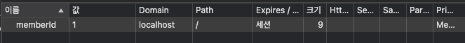

# Cookie만들기

로그인의 상태를 유지하기 위해서는 Cookie를 서버에서 클라이언트에 보내주어야한다.

```java

@Slf4j
@RequiredArgsConstructor
@Controller
public class LoginController {
    private final LoginService loginService;
    private final HttpServletResponse httpServletResponse;

    @GetMapping("/login")
    public String loginForm(Model model) {
        model.addAttribute("loginForm", new LoginForm());
        return "login/loginForm";
    }

    @PostMapping("/login")
    public String login(@Validated LoginForm form, BindingResult bindingResult, HttpServletResponse response) {
        if (bindingResult.hasErrors()) {
            log.info("LogIn form error: {}", bindingResult);
        }
        Member member = loginService.login(form.getLoginId(), form.getPassword());
        if (member == null) {
            bindingResult.reject("loginFail", "Invalid loginId or password");
            return "login/loginForm";
        }
        // 로그인 성공 처리  
        // 쿠키에 시간 정보를 주지 않으면 세션 쿠키 이다(브라우저 종료시 모두 종료)  
        Cookie idCookie = new Cookie("memberId", String.valueOf(member.getId()));
        response.addCookie(idCookie);
        log.info("Login Success");
        return "redirect:/";
    }
}
```

로그인에 성공하면 쿠키를 생성하고 `HttpServletResponse`에 담는다.(**`HttpServletResponse`에 쿠키 정보를 담는 이유는, 쿠키는 서버에서 생성해서 클라이언트로 `응답`하는 개념이기
때문이다.**)
쿠키 이름은 `memberId`이고, 값은 회원의`id`를 담아둔다. 웹 브라우저는 종료 직전 전까지 회원의`id`를 서버에 계속 보내줄 것이다.
**실행**

이제 로그인을 해보고 Cookie가 잘 세팅되었는지 확인해보자.
크롬 브라우저를 통해 HTTP 응답 헤더에 쿠키가 추가된 것을 확인할 수 있다.


**로직 분석**

- 로그인 쿠키( `memberId` )가 없는 사용자는 기존 `home` 으로 보낸다. 추가로 로그인 쿠키가 있어도 회원이 없으면`home` 으로 보낸다.
- 로그인 쿠키( `memberId` )가 있는 사용자는 로그인 사용자 전용 홈 화면인 `loginHome` 으로 보낸다. 추가로 홈화면에 화원 관련 정보도 출력해야 해서 `member` 데이터도 모델에 담아서
  전달한다.

로그인에 성공하면 사용자 이름이 출력되면서 상품 관리, 로그아웃 버튼을 확인할 수 있다. 로그인에 성공시 세션 쿠키가 지속해서 유지되고, 웹 브라우저에서 서버에 요청시 `memberId` 쿠키를 계속 보내준다.

### 로그아웃 기능

세션 쿠키이므로 웹 브라우저 종료시, 서버에서 해당 쿠키의 종료 날짜를 0으로 지정

```java

@PostMapping("/logout")
public String logout(HttpServletResponse response) {

    expireCookie(response, "memberId");

    return "redirect:/";
}

private void expireCookie(HttpServletResponse response, String cookieName) {
    Cookie cookie = new Cookie(cookieName, null);
    cookie.setMaxAge(0);
    response.addCookie(cookie);

}
```

**실행**

로그아웃도 응답 쿠키를 생성하는데 `Max-Age=0` 를 확인할 수 있다. 해당 쿠키는 즉시 종료된다.
