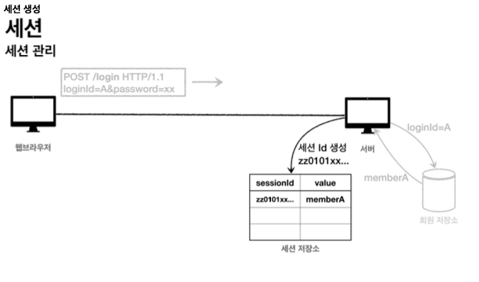

# 쿠키와 보안 문제 그리고 세션
쿠키를 사용해서 로그인Id를 전달해서 로그인을 유지할 수 있었다. 그런데 여기에는 심각한 보안 문제가 있다.

**보안 문제**
- **쿠키 값은 임의로 변경할 수 있다.**
	- 클라이언트가 쿠키를 강제로 변경하면 다른 사용자가 된다.
	- 실제 웹브라우저 개발자모드 Application Cookie 변경으로 확인
	- `Cookie: memberId=1` `Cookie: memberId=2` (다른사용자의이름이보임)
- **쿠키에 보관된 정보는 훔쳐갈 수 있다.**
	- 만약 쿠키에 개인정보나, 신용카드 정보가 있다면?
	- 이 정보가 웹 브라우저에도 보관되고, 네트워크 요청마다 계속 클라이언트에서 서버로 전달된다.
	- 쿠키의 정보가 나의 로컬 PC에서 털릴 수도 있고, 네트워크 전송 구간에서 털릴 수도 있다.
- 해커가 쿠키를 한번 훔쳐가면 평생 사용할 수 있다.
	- 해커가 쿠키를 훔쳐가서 그 쿠키로 악의적인 요청을 계속 시도할 수 있다.

**대안**
- 쿠키에 중요한 값을 노출하지 않고, 사용자 별로 예측 불가능한 임의의 토큰(랜덤 값)을 노출하고, 서버에서 토큰과 사용자 id를 매핑해서 인식한다. 그리고 서버에서 토큰을 관리한다.
- 토큰은 해커가 임의의 값을 넣어도 찾을 수 없도록 예상 불가능 해야 한다.
- 해커가 토큰을 털어가도 시간이 지나면 사용할 수 없도록 서버에서 해당 토큰의 만료시간을 짧게(예: 30분) 유지한다. 또는 해킹이 의심되는 경우 서버에서 해당 토큰을 강제로 제거하면 된다.

이러한 방식으로 인해 쿠키에 중요한 정보를 복관하는 방법은 여러가지 보안 이슈가 있었다. 이 문제를 해결하기 위해 결국 중요한 정보를 모두 서버에 저장해야한다. 그리고 클라이언트와 서버는 추정 불가능한 임의의 식별자 값으로 연결해야한다.

**이렇게 서버에 중요한 정보를 보관하고 연결을 유지하는 방법을 세션이라고한다.**

세션 ID를 생성하는데, 추정 불가능해야 한다.

**UUID는 추정이 불가능하다.**

- `Cookie: mySessionId=zz0101xx-bab9-4b92-9b32-dadb280f4b61`
  생성된 세션 ID와 세션에 보관할 값( `memberA` )을 서버의 세션 저장소에 보관한다.

세션 ID를 생성하는데, 추정 불가능해야 한다.
**UUID는 추정이 불가능하다.**
- `Cookie: mySessionId=zz0101xx-bab9-4b92-9b32-dadb280f4b61`
  생성된 세션 ID와 세션에 보관할 값( `memberA` )을 서버의 세션 저장소에 보관한다.(**중요한 데이터는 서버에 저장**) 그리고 클라이언트에는 임의로 만든 sessionId값을 보낸다.

**클라이언트와 서버는 결국 쿠키로 연결이 되어야 한다.**
- 서버는 클라이언트에 `mySessionId` 라는 이름으로 세션ID만 쿠키에 담아서 전달한다.
- 클라이언트는 쿠키 저장소에 `mySessionId` 쿠키를 보관한다.

**중요**
- 여기서 중요한 점은 회원과 과련된 정보는 전혀 클라이언트에 전달하지 않는 것이다. 오로지 랜덤으로 생성된 임의의 `sessionId`만 보낸다.

**로그인 이후**
- 클라이언트는 요청시 항상 `mySessionId` 쿠키를 서버에 전달한다.
- 서버에서는 클라이언트가 전달한 `mySessionId` 쿠키 정보로 세션 저장소를 조회해서 로그인시 보관한 세션 정보를 사용한다.

**정리**
임의의 랜덤값인 세션을 사용해서 중요한 정보를 관리하게 되었다. 덕분에 다음과 같은 보안 문제들을 해결할 수 있다.
- **쿠키 값을 변조 가능** -> 예상 불가능한 복잡한 세션Id를 사용한다.
- 쿠키에 보관하는 정보는 클라이언트 해킹시 털릴 가능성이 있다. 세션 Id가 털려도 여기에는 중요한 정보가 없다.(단순 랜덤값)
- **쿠키 탈취 후 사용** -> 해커가 토큰을 털어가도 시간이 지나면 사용할 수 없도록, 서버에서 세션의 만료시간을 짧게, (예: 30분) 유지한다. 또는 해킹이 의심되는 경우 서버에서 해당 세션을 강제로 제거하면된다.

